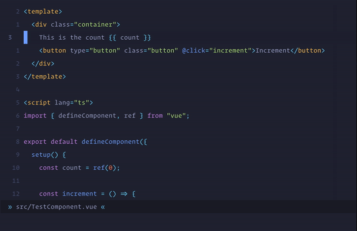
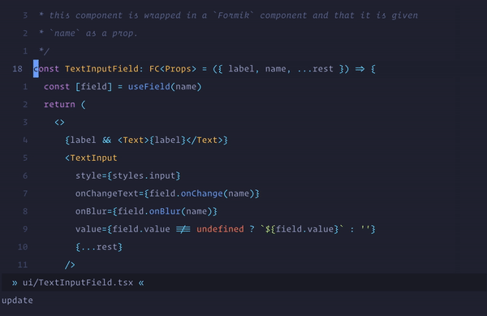
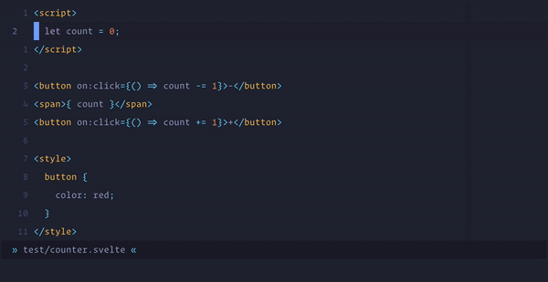
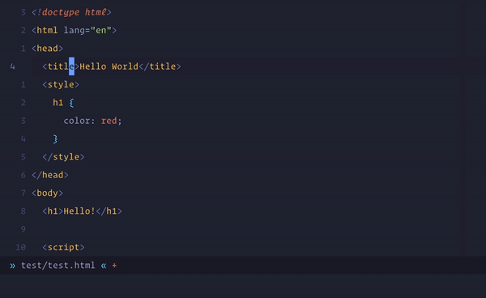

# `nvim-ts-context-commentstring`

A Neovim plugin for setting the `commentstring` option based on the cursor
location in the file. The location is checked via treesitter queries.

This is useful when there are embedded languages in certain types of files. For
example, Vue files can have many different sections, each of which can have a
different style for comments.

Note that this plugin *only* changes the `commentstring` setting. It does not 
add any mappings for commenting. It is recommended to use a commenting plugin 
like [`vim-commentary`](https://github.com/tpope/vim-commentary/) alongside this 
plugin.




## Getting started

**Requirements:**

- [Neovim nightly (version 0.5
  prerelease)](https://github.com/neovim/neovim/releases/tag/nightly)
- [`nvim-treesitter`](https://github.com/nvim-treesitter/nvim-treesitter/)

**Installation:**

Use your favorite plugin manager. For example, here's how it would look like
with Packer:

```lua
use 'JoosepAlviste/nvim-ts-context-commentstring'
```

**Setup:**

Enable the module from `nvim-treesitter` setup

```lua
require'nvim-treesitter.configs'.setup {
  context_commentstring = {
    enable = true
  }
}
```

Don't forget to use [lua
heredoc](https://github.com/nanotee/nvim-lua-guide#using-lua-from-vimscript) if
you're using `init.vim`

**Recommended: Using a commenting plugin**

It is recommended to use a commenting plugin like 
[`vim-commentary`](https://github.com/tpope/vim-commentary/) together with this 
plugin. `vim-commentary` provides the mappings for commenting which use the 
`commentstring` setting. This plugin adds to that by correctly setting the 
`commentstring` setting so that `vim-commentary` can do its thing even in more 
complex filetypes.

There is an additional integration with `vim-commentary` specifically, which 
optimizes the `commentstring` updating logic so that it is not run 
unnecessarily. If `vim-commentary` is detected, then this plugin automatically 
sets up `vim-commentary` mappings to first update the `commentstring`, and then 
trigger `vim-commentary`.

Let me know if you'd like a similar integration for another commenting plugin.


## Configuration

### Adding support for more languages

Currently, the following languages are supported when they are injected with 
language tree (see 
[`lua/ts_context_commentstring/internal.lua`](./lua/ts_context_commentstring/internal.lua)):

- `javascript`
- `typescript`
- `tsx`
- `css`
- `scss`
- `php`
- `html`
- `svelte`

This means that in any filetype, if the given languages are injected, this 
plugin should detect them and correctly set the `commentstring`. For example, 
Vue files can be injected with `css` or `javascript`. Even though we don't 
configure anything for Vue explicitly, the `commentstring` updating logic should
still work.

Support for more languages can be added quite easily by passing a `config` table
when configuring the plugin:

```lua
require'nvim-treesitter.configs'.setup {
  context_commentstring = {
    enable = true,
    config = {
      css = '// %s'
    }
  }
}
```

Additionally, some languages are not injected with language tree, but have 
multiple commenting styles in the same language. One such example is JavaScript 
with JSX. The JSX section is not an injected language, but a part of the tree 
generated by the `javascript` treesitter parser.

In this more complex case, this plugin supports adding queries for specific 
treesitter nodes. Each node can have its own unique commenting style. For 
example, here's how the default configuration for `javascript` would look like:

```lua
require'nvim-treesitter.configs'.setup {
  context_commentstring = {
    enable = true,
    config = {
      javascript = {
        __default = '// %s',
        jsx_element = '{/* %s */}',
        jsx_fragment = '{/* %s */}',
        jsx_attribute = '// %s',
        comment = '// %s'
      }
    }
  }
}
```

The `__default` value is used when none of the other node types are seen. The 
rest of the keys refer to the type of the treesitter node. In this example, if 
your cursor is inside a `jsx_element`, then the `{/* %s */}` `commentstring` 
will be set.

Note that the language refers to the *treesitter* language, not the filetype or 
the file extension.


### Behavior

The default behavior is to trigger `commentstring` updating on `CursorHold`. If
your `updatetime` setting is set to a high value, then the updating might not
be triggered. Let me know if you'd like to have this be customized by creating
an issue. Another candidate might be the `CursorMoved` autocommand.

The default `CursorHold` autocommand can be disabled by passing `enable_autocmd 
= false` when setting up the plugin:

```lua
require'nvim-treesitter.configs'.setup {
  context_commentstring = {
    enable = true,
    enable_autocmd = false,
  }
}
```

Then, you can call the `update_commentstring` function manually:

```lua
nnoremap <leader>c <cmd>lua require('ts_context_commentstring.internal').update_commentstring()<cr>
```

**Note:** It is not necessary to use this option if you are using 
`vim-commentary`, the integration is set up automatically.


## More demos

**React:**



**Svelte:**



**HTML:**


